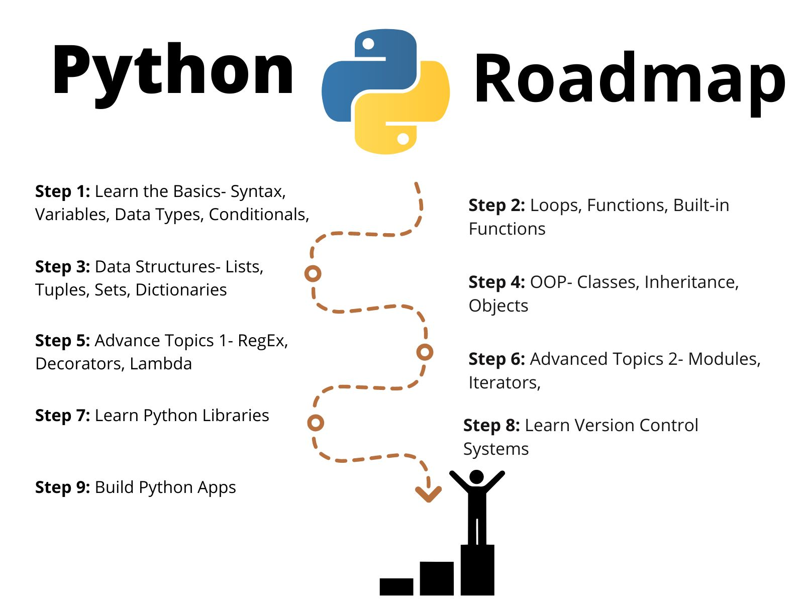

# Full Python Course

# Python Programming Course 🐍  

Welcome to the **Python Programming Course**! This course is designed to take you from a beginner to an advanced Python developer through a structured learning path. Below is the curriculum breakdown, organized into six comprehensive modules.

---

## 📚 Course Overview  
This course covers fundamental to advanced Python concepts, with hands-on examples and practical exercises. Each module builds on the previous one, ensuring a smooth learning curve.

---

## 🗂️ Curriculum  

### 01: Learn the Basics  
- **Topics**: Syntax, Variables, Data Types, Conditionals  
- **Description**: Start with Python syntax, variables, basic data types (integers, strings, booleans, etc.), and control flow using conditionals (`if-elif-else`).  

### 02: Loops, Functions, and Built-in Functions  
- **Topics**: `for`/`while` loops, defining functions, Python's built-in functions (e.g., `len()`, `range()`, `print()`).  
- **Description**: Master loops for iteration, create reusable code with functions, and leverage Python’s powerful built-in tools.  

### 03: Data Structures  
- **Topics**: Lists, Tuples, Sets, Dictionaries  
- **Description**: Explore core data structures for organizing and manipulating data efficiently. Learn their methods, use cases, and differences.  

### 04: Object-Oriented Programming (OOP)  
- **Topics**: Classes, Inheritance, Objects  
- **Description**: Dive into OOP principles. Create classes, design hierarchies with inheritance, and instantiate objects to model real-world scenarios.  

### 05: Advanced Topics I  
- **Topics**: Regular Expressions (RegEx), Decorators, Lambda Functions  
- **Description**: Level up with RegEx for pattern matching, use decorators to modify function behavior, and write concise code with lambda expressions.  

### 06: Advanced Topics II  
- **Topics**: Modules, Iterators, Generators  
- **Description**: Learn to organize code into modules, create custom iterators, and use generators for memory-efficient data processing.  

---

## 🚀 How to Use This Course  
1. **Follow Sequentially**: Complete modules in order for foundational knowledge.  
2. **Code Along**: Practice with provided examples and exercises.  
3. **Experiment**: Modify code snippets to test your understanding.  
4. **Review**: Revisit earlier modules if you encounter challenges.  

---

## 🛠️ Prerequisites  
- No prior programming experience required.  
- Basic computer literacy (file management, text editing).  
- Install [Python](https://www.python.org/downloads/) (version 3.8+ recommended).  

---

## 📦 Additional Resources  
- **Books**: *Automate the Boring Stuff with Python* by Al Sweigart.  
- **Online Tutorials**: [Real Python](https://realpython.com/), [W3Schools Python](https://www.w3schools.com/python/).  
- **Communities**: [Python Discord](https://discord.gg/python), [Stack Overflow](https://stackoverflow.com/).  

---

## 🤝 Contributing  
Found a typo or have suggestions? Open an issue or submit a pull request on [GitHub](link-to-repo).  

---

## 📜 License  
This course is licensed under the [MIT License](link-to-license).  

**Happy Coding!** 🎉  

